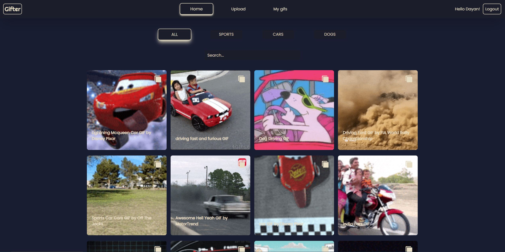
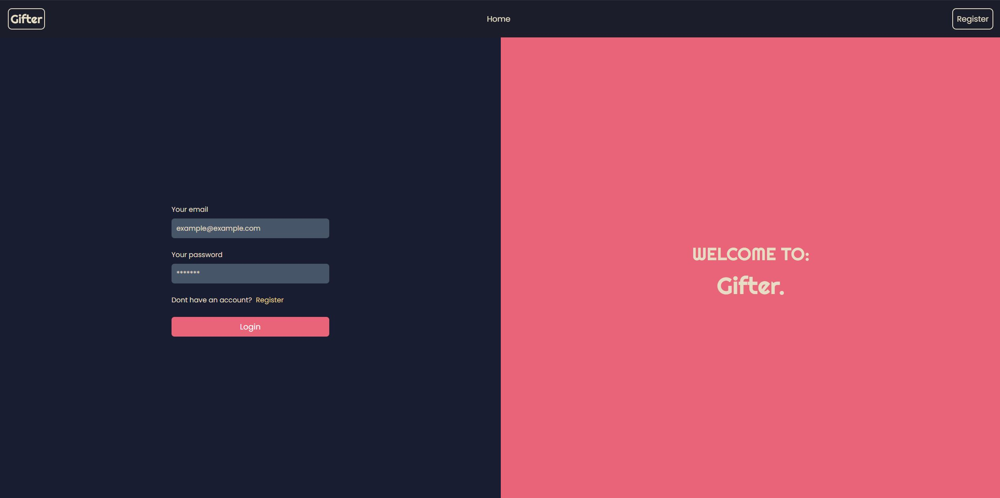
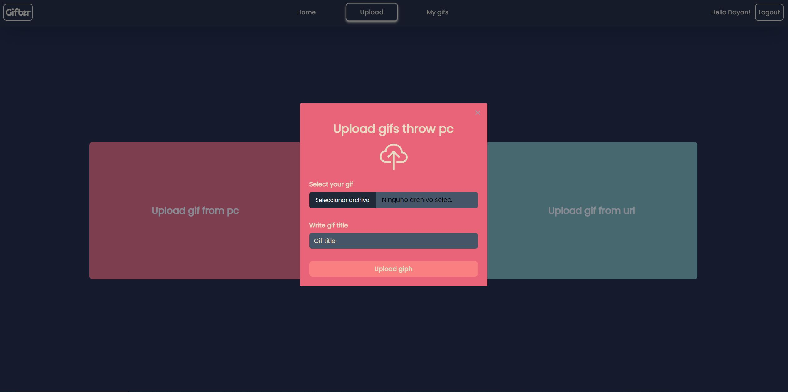
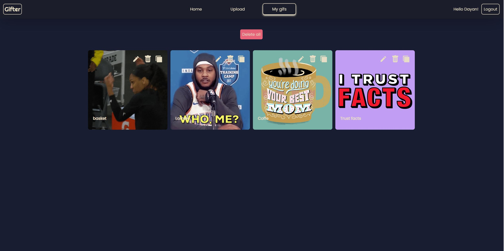
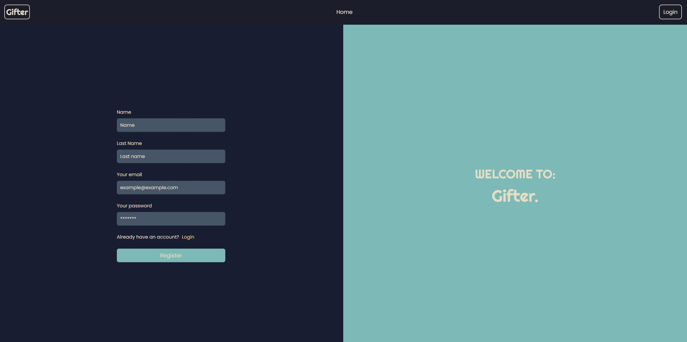
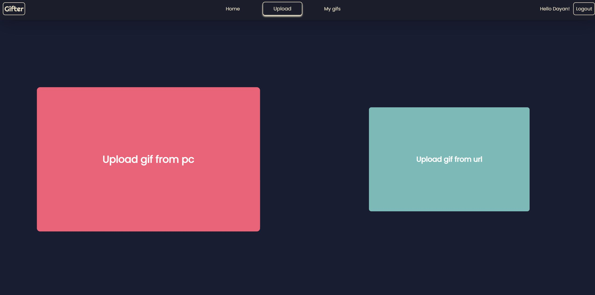

# GIF-APP-BACK

### MEDIA

---

---

---

---

---

### Clone the repository:

https://github.com/Psicowar/GIPH-APP-FRONT

## Environment Variables

Create a .env file, write: JWT_SECRET: "and here, the key you want"

## Install required dependencies:

npm install

## Run:
npm start

---

### Project Description

Backend of gif page to upload, search, edit and delete gifs

---
### Used Technologies
Node

TypeScript

---
### Used Libraries

Axios

Bcrypt

Cors

Dotenv

Express

Helmet

Jsonwebtoken

Mongoose

---

### Used IDE

https://code.visualstudio.com/

---
## Autors

<li>Dayan Álvarez Martínez</li>
    